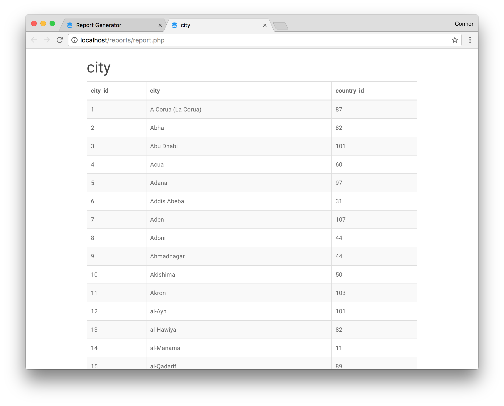

# Database Report Generator Tool  
A simple tool for generating HTML or CSV reports on MySQL databases.  

  
  

## Requirements
PHP 7  
PDO PHP Extension  

## Setup
1. Install and enable the PDO extension ([installation instructions][3e07ed03]).  
2. Create a copy of `config/config_template.php` named `config/config.php` and fill out the relevant connection information.  
  - **SQL_SERVER** - Server where the MySQL database is located  
  - **SQL_PORT** - MySQL port number (will use default if left blank e.g. 3306)  
  - **SQL_DATABASE** - Name of the database to generate reports for  
  - **SQL_USER** - User with SELECT permissions for SQL_DATABASE  
  - **SQL_PASSWORD** - Password for SQL_USER  

## Usage

### Single Table

1. Select the table you want to generate a report for.  
2. Select the columns you want to include in the report.  
3. Click 'Generate Report' to open the report in a new tab or click 'Download Report as CSV' to export the report as a CSV. Both options open up a new tab, so you can generate multiple reports with different tables and columns without reloading the page.  

### Joining Tables  

1. Select the 'Join Tables' option and click 'Select Tables to Join'. Select the tables you want to join and click 'Next'.
  

2. Drag the tables in the order you want them to get joined in and click 'Next'.
  

3. Select the type of join and the columns to join on for each table getting joined and click 'Submit'.
  

4. Select the columns from each table you would like to display.
  
5. Click 'Generate Report' to open the report in a new tab or click 'Download Report as CSV' to export the report as a CSV. Both options open up a new tab, so you can generate multiple reports with different tables and columns without reloading the page.

  [3e07ed03]: http://php.net/manual/en/pdo.installation.php "PDO Installation"
