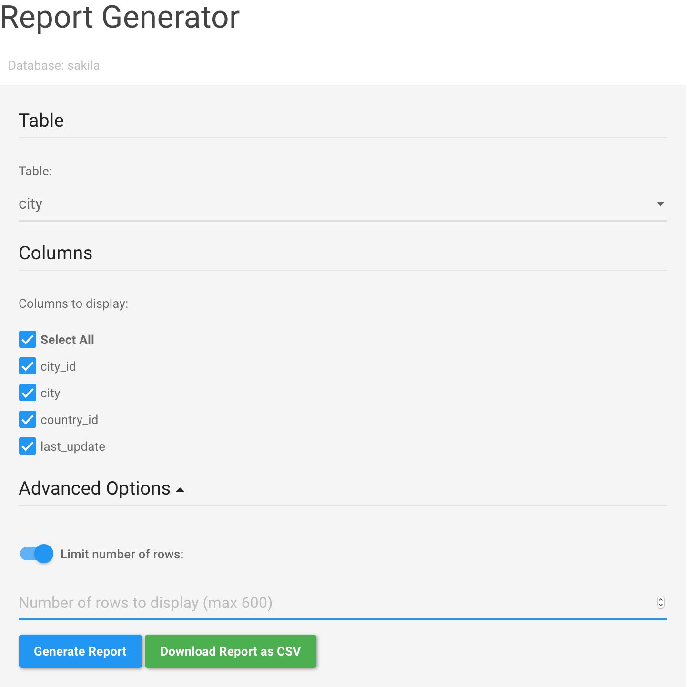

# Database Report Generator Tool  
A simple tool for generating reports on MySQL databases. The reports can be generated in-browser or downloaded as CSV files.  

## Requirements
PHP 7  
PDO PHP Extension  

## Setup
1. Install and enable the PDO extension ([installation instructions][3e07ed03]).  
2. Create a copy of `config_template.ini` named `config.ini` and fill out the relevant connection information.  
  - **SQL_SERVER** - Server where the MySQL database is located  
  - **SQL_DATABASE** - Name of the database to generate reports for  
  - **SQL_PORT** - MySQL port number (will use default if left blank e.g. 3306)  
  - **SQL_USER** - User with select permissions for SQL_DATABASE  
  - **SQL_PASSWORD** - Password for SQL_USER  

## Usage
1. Select the table you want to generate a report for.  
2. Select the columns you want to include in the report.  
3. Click 'Generate Report' to open the report in a new tab or click 'Download Report as CSV' to export the report as a CSV. Both options open up a new tab, so you can generate multiple reports with different tables and columns without reloading the page.  

## Screenshots
  

  [3e07ed03]: http://php.net/manual/en/pdo.installation.php "PDO Installation"
